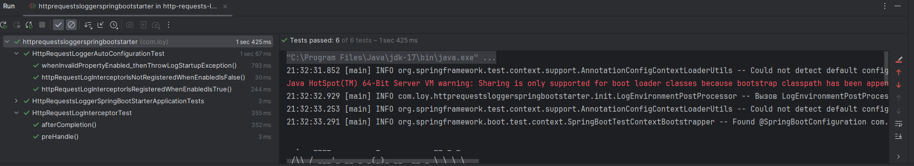

## Spring Boot Starter для логирования HTTP запросов

_**Инструкция по запуску:**_

1. Чтобы запустить стартер нужно:
-  склонировать проект из репозитория;
-  выполнить команду mvn install;

2. Открыть Spring Boot приложение, в котором нужен данный стартер
- добавить зависимость в pom:
   ```
   <dependency>
            <groupId>com.loy</groupId>
            <artifactId>http-requests-logger-spring-boot-starter</artifactId>
            <version>0.0.1</version>
   </dependency>
   ```
  - для активации логирования прописать свойство в **application.yaml** :
     ```
     http-request-log:
        enabled: true
     ```
  - для активации логирования http запросов и логирования времени их обработки прописать свойства в **application.yaml** :
     ```
     http-request-log:
        enabled: true
        duration-log: true
     ```

3. Пример вывода логов:
```
URL: http://localhost:8080/
Статус: 200 OK
Заголовки запроса: {postman-token=c7f354f0-92c9-4255-9768-d3a617c9cccd, host=localhost:8080, connection=keep-alive, cache-control=no-cache, accept-encoding=gzip, deflate, br, user-agent=PostmanRuntime/7.41.1, accept=*/*}
Заголовки ответа: {Keep-Alive=timeout=60, Connection=keep-alive, Content-Length=2, Date=Tue, 20 Aug 2024 20:54:20 GMT, Content-Type=text/plain;charset=UTF-8}
 ```

4. Для логирования http запросов использовался Interceptor
5. Скрин прохождения тестов:
